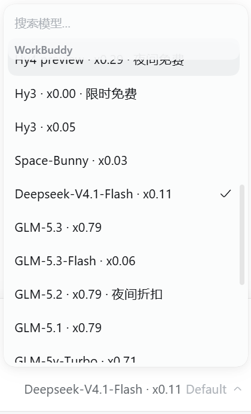
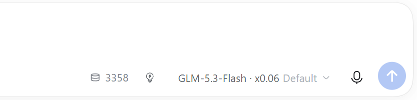
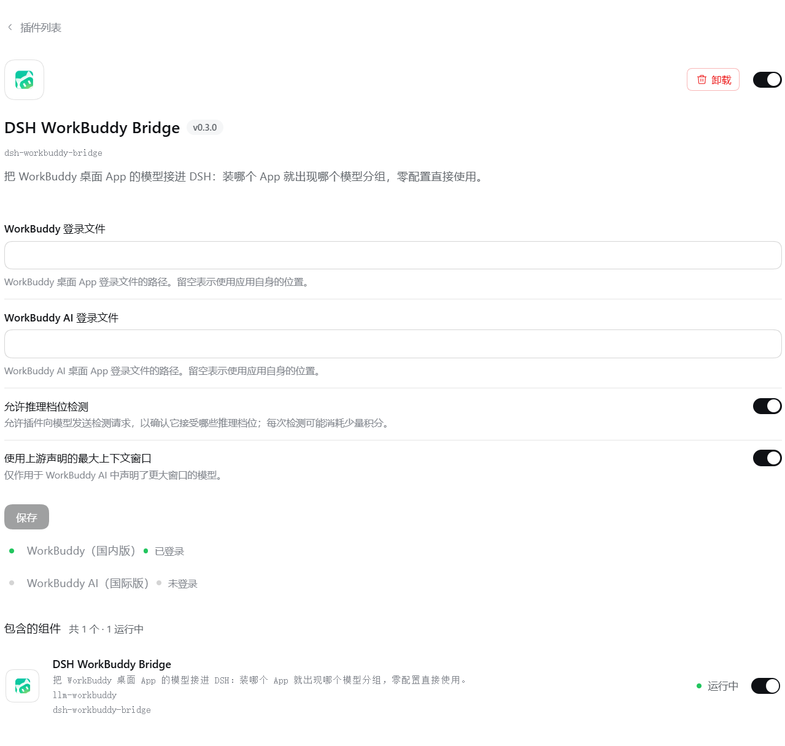
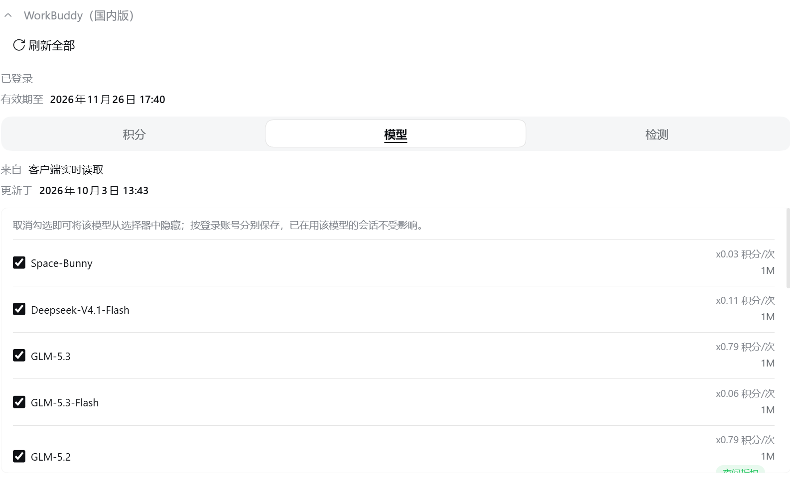
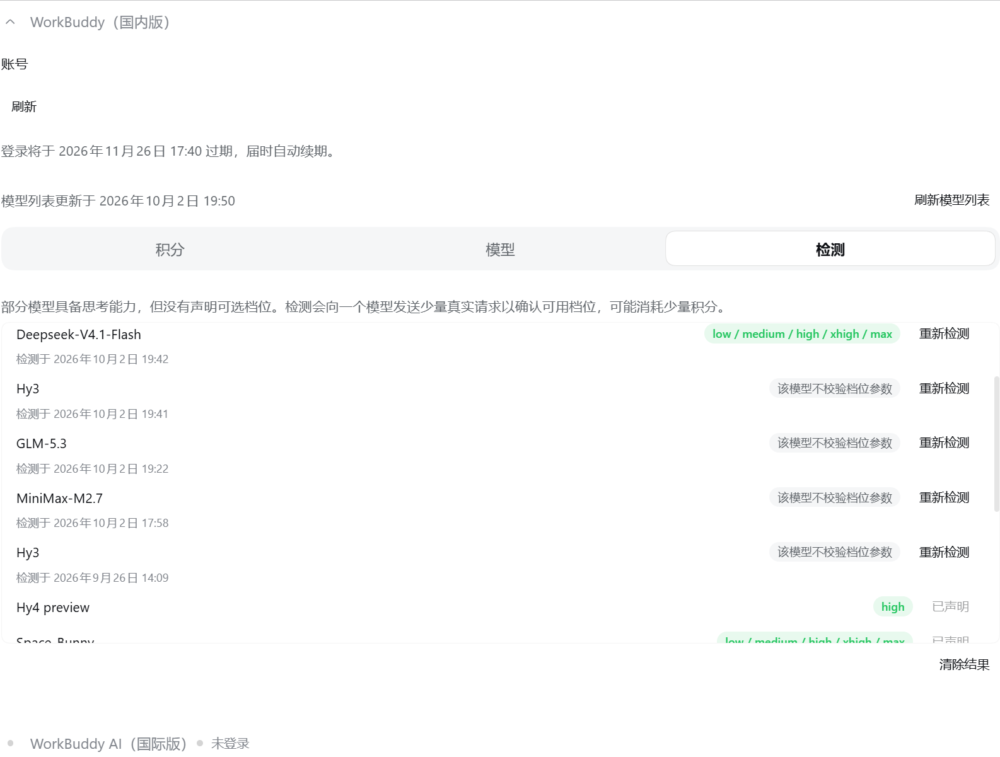
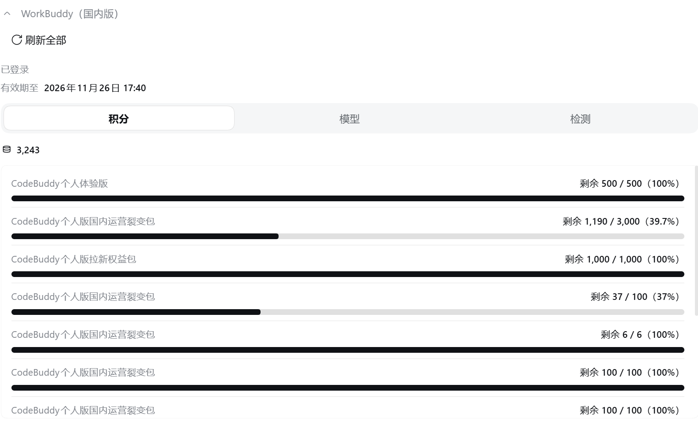
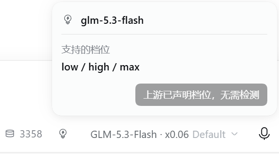

<p align="center">
  
</p>

<p align="center">
  <h1 align="center">dsh-workbuddy-bridge</h1>
</p>

<div align="center">
  <p><strong>把 WorkBuddy 桌面 App 的模型接进 DSH 对话窗口</strong></p>
  <p><em>WorkBuddy desktop models in DeepSeek Harness</em></p>

  <p>
    <a href="https://www.npmjs.com/package/dsh-workbuddy-bridge"></a>
    <a href="https://github.com/zlZayn/dsh-workbuddy-bridge/actions/workflows/ci.yml"></a>
    <a href="https://github.com/deepseek-ai/deepseek-harness"></a>
    <a href="LICENSE"></a>
  </p>

  <p>
    各版本改动 → <a href="https://github.com/zlZayn/dsh-workbuddy-bridge/releases">Releases</a>（与 npm 版本一一对应）
  </p>

  <p>
    <strong><a href="README.md">简体中文</a></strong> · <a href="README_en.md">English</a>
  </p>
</div>

---

> [!NOTE]
> **凭据不出本机**：登录状态取自 WorkBuddy 桌面 App 自己的凭据文件，插件只在本机留一份加密副本；
> 浏览器半边拿不到令牌，界面里也永远不出现凭据原文。

国内版 **WorkBuddy** 与国际版 **WorkBuddy AI** 并存：装哪个 App 就出现哪个模型分组，两个都装就两组并排，
各自用自己的账号与积分。模型直接出现在 DSH 的模型选择器里，不必为它单独配一个 provider。

<p align="center">
  
  <br>
  <em>国内版在模型选择器中自成一组，模型名后直接跟积分倍率与促销徽章；装国际版则出现「WorkBuddy AI」组。</em>
</p>

## 能力

- **开箱即用** —— 装完启用，模型分组自己出现。
- **两版隔离** —— 国内版与国际版各自分组，模型、账号、积分互不混用，只跟随各自 App 的登录状态。
- **推理档位** —— 上游声明了档位的模型直接可选；没声明的可在插件页**手动检测**。
  灯泡表示「这个模型能切档位」，不是「检测过」——已声明的模型也显示灯泡，只是不需要检测。
- **积分可见** —— 每条回复下方显示本次消耗，模型选择器旁常驻剩余积分。观测不到就不显示。
- **模型显隐** —— 卡片「模型」标签里勾选哪些模型出现在选择器里，按登录账号分别保存。
- **图片输入** —— 多数模型可直接粘贴或拖入图片；纯文字模型会明确说明。
- **三种界面** —— Web / Desktop / TUI；仅 TUI 无手动检测。

<p align="center">
  
  <br>
  <em>对话窗口里每天看到的样子：币图标与余额、推理档位灯泡，再往右是模型名——都排在同一行。</em>
</p>

<p align="center">
  
  <br>
  <em>插件页：上面是配置表单，下面两张卡片各跟随自己 App 的登录状态。</em>
</p>

## 安装

前置只有一条：已安装并登录 **WorkBuddy 桌面 App**（国际版为 WorkBuddy AI App）—— 插件复用 App 的登录状态。

```sh
dsh plugin --profile web add dsh-workbuddy-bridge
dsh web
```

Desktop 与 TUI 把 `--profile web` 换成 `desktop` / `dsh-tui`（TUI 需终端插件
`@deepseek-harness-tui/dsh-tui` ≥ `0.10.0-beta.5`，详见其文档）。

也可以从源码安装：

```sh
git clone https://github.com/zlZayn/dsh-workbuddy-bridge.git
cd dsh-workbuddy-bridge
pnpm install && pnpm build
dsh plugin --profile web add "$PWD"
```

## 插件页

侧边栏 **插件（Plugins）** → 已安装 → 点 **DSH WorkBuddy Bridge**。配置区在描述下面，保存即生效：

- **登录文件路径**（国内版 / 国际版）—— 留空即用 App 自己的位置。
- **允许推理档位检测**、**使用上游声明的最大上下文窗口** —— 两个开关。

<p align="center">
  
  <br>
  <em>「模型」标签：勾选哪些模型出现在选择器里，同时看窗口与倍率。</em>
</p>

<p align="center">
  
  
  <br>
  <em>左「检测」：每个推理模型一行，点按钮确认它接受哪些推理档位；右「积分」：总余额，下面是各套餐的余量条。</em>
</p>

## 为什么是手动检测

上游不保证档位信息可靠——实测有的模型**接受** `reasoning_effort` 却忽略未知值。
所以插件不猜：按需对单个模型发少量真实请求确认；结果只表示**上游当前接受该档位**，
不承诺它改变推理行为。已声明档位的模型跳过这一步，直接用声明值。
机制与取舍见 [docs/ARCHITECTURE.md](docs/ARCHITECTURE.md)。

<p align="center">
  
  <br>
  <em>已声明档位的模型：灯泡点亮、档位直接可选，检测按钮禁用。</em>
</p>

## 兼容与限制

无凭据的分组不显示。宿主版本下限、平台支持、目录来源与已知缺口
→ [docs/COMPATIBILITY.md](docs/COMPATIBILITY.md)。

设计取舍 → [docs/ARCHITECTURE.md](docs/ARCHITECTURE.md)；发版流程 → [docs/PUBLISHING.md](docs/PUBLISHING.md)；
维护者文档地图 → [AGENTS.md](AGENTS.md)。

## 免责声明

- 本项目**仅供个人学习和研究使用**，仅驱动使用者自己的 WorkBuddy 账号在本机调用，请勿用于商业用途或超出个人合理使用的场景。
- 使用者需遵守 WorkBuddy 的服务条款；因使用本项目产生的任何后果，由使用者自行承担。
- 本项目与腾讯、WorkBuddy、DeepSeek 均无关联，未获其授权或认可；文中出现的名称仅用于描述兼容关系，其商标权利归各自所有。

## 致谢

- [Sliverkiss/workbuddy2api](https://github.com/Sliverkiss/workbuddy2api)（MIT）— WorkBuddy 上游协议的参照实现。
- [franksong2702/dsh-codex-connect](https://github.com/franksong2702/dsh-codex-connect)（Apache-2.0）— DSH 插件结构与 provider 注册的参照。

## 许可

[MIT](LICENSE)。

## 贡献

流程与本地钩子 → [CONTRIBUTING.md](CONTRIBUTING.md)。缺陷与需求走仓库 Issues。
