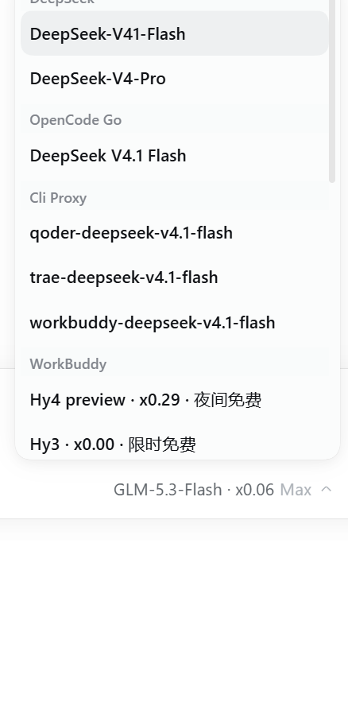
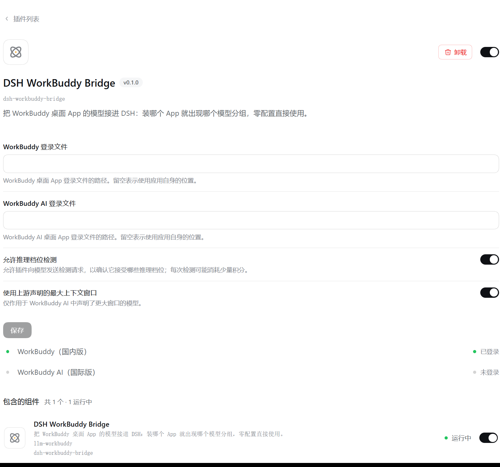
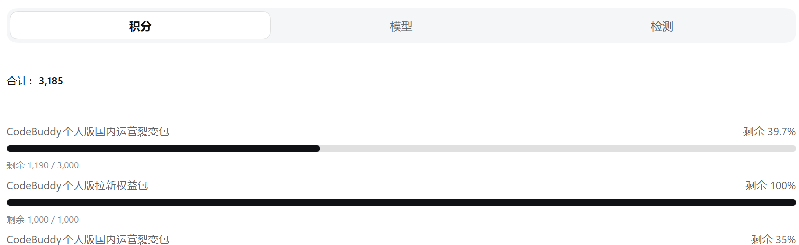
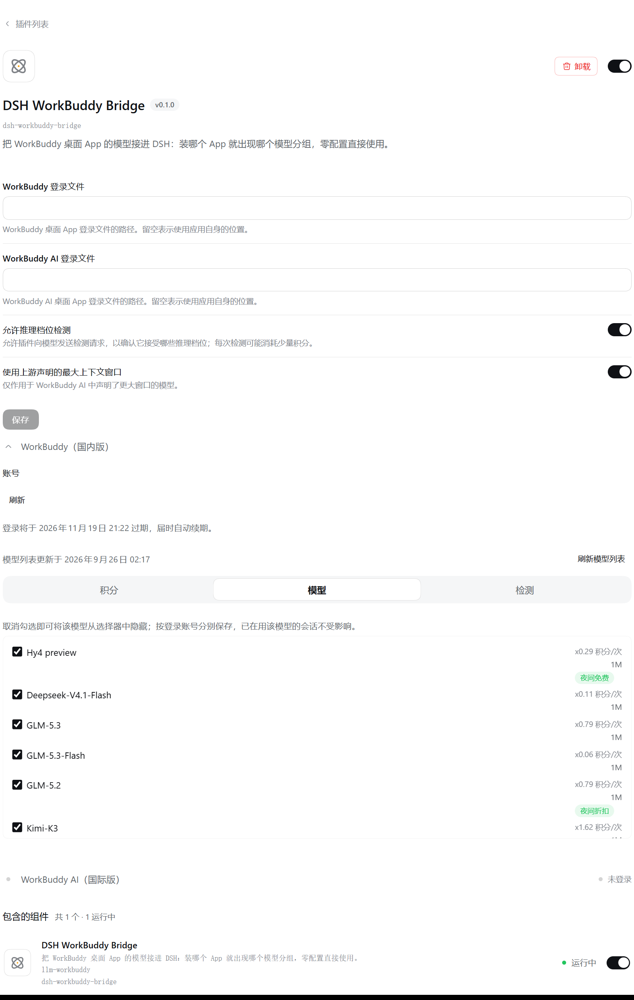
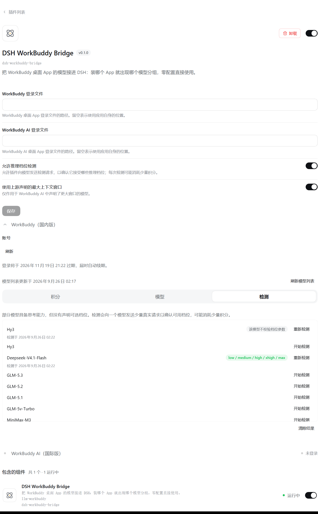
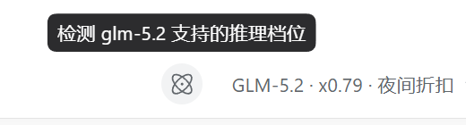

<p align="center">
  <h1 align="center">dsh-workbuddy-bridge</h1>
</p>

<div align="center">
  <p><strong>WorkBuddy desktop models in your DSH chat</strong></p>
  <p><em>把 WorkBuddy 桌面 App 的模型接进 DSH 对话窗口</em></p>

  <p>
    <a href="https://github.com/deepseek-ai/deepseek-harness"></a>
    <a href="https://github.com/zlZayn/dsh-workbuddy-bridge/actions/workflows/ci.yml"></a>
    <a href="LICENSE"></a>
  </p>

  <p>
    <a href="README.md">简体中文</a> · <strong><a href="README_en.md">English</a></strong>
  </p>
</div>

---

> [!NOTE]
> **Credentials never leave your machine**: the sign-in state is read from the WorkBuddy desktop
> app's own credential file and kept as one encrypted local copy. The browser half never receives
> the token, and no credential text ever reaches the UI.

The CN **WorkBuddy** and the international **WorkBuddy AI** apps live side by side: whichever you
have installed shows up as its own model group, and both installed shows both groups, each with its
own account and credit. The models appear directly in the DSH model picker — no separate provider to configure.

<p align="center">
  
  <br>
  <em>The CN version forms its own group in the model picker (with credit rates and promo badges), beside DSH's
  own groups; installing the international version adds a "WorkBuddy AI" group the same way.</em>
</p>

## Capabilities

- **Works out of the box**: install and enable — the model groups appear on their own, with nothing required to fill in.
- **The two versions never mix**: the CN app is the "WorkBuddy" group and the international one is "WorkBuddy AI";
  models, accounts, and credit stay separate. **Each group follows only its own app's sign-in** — sign out of one
  and that group disappears, leaving the other untouched.
- **Image input**: most models accept pasted or dropped images (GLM-5.3-Flash, GLM-5.2, the DeepSeek-V4 series, and more);
  the few text-only models (e.g. GLM-5.1) say so explicitly.
- **Reasoning levels**: models that declare levels expose them directly (low / high / max on GLM-5.3 and GLM-5.3-Flash);
  models that do not can be **checked manually** on Web and Desktop (see [Why detection is manual](#why-detection-is-manual)).
  Models without a check result or usable levels keep WorkBuddy's default.
- **Model visibility**: the card's "Models" tab selects which models appear in the picker; the choice is
  **saved per signed-in account** and follows account switches. Hiding only affects pickability — **chats already
  using that model keep working**.
- **Account and credit**: the plugin page shows the account, token validity (auto-renewed), remaining credit, and model
  offers; it can refresh the model list and shows whether the list came from the upstream or the built-in fallback.
- **Rates and promos**: each model name carries its credit multiplier (e.g. `GLM-5.2 · x0.79`) and promo badges
  (limited-time free / night discount) in both the `/model` popup and the composer dropdown. The rate is display-only.
- **Enterprise accounts**: CN enterprise accounts read their cycle quota from the enterprise billing endpoint, and the
  card shows an "enterprise quota" row with the reset time.
- **The plugin page shows a display name**: `DSH WorkBuddy Bridge` (the same in both UI languages), with the
  package name `dsh-workbuddy-bridge` on the code-style line beneath it.

## Install

### Prerequisites

- The **WorkBuddy desktop app** is installed and signed in (WorkBuddy AI for the international version). The plugin
  reuses the app's sign-in state and follows account switches; the two versions do not affect each other.
- The DSH version range is whatever [package.json](package.json) declares in `engines` and `peerDependencies` —
  this repository tracks the **DSH `0.1.7` line** only.
- Node 22+ (same source: `engines.node`).

### From npm

```sh
dsh plugin --profile web add dsh-workbuddy-bridge
dsh web
```

### From source

```sh
git clone https://github.com/zlZayn/dsh-workbuddy-bridge.git
cd dsh-workbuddy-bridge
pnpm install && pnpm build

dsh plugin --profile web add "$PWD"
dsh web
```

### Other interfaces

```sh
# Desktop (the DSH Desktop app)
dsh plugin --profile desktop add dsh-workbuddy-bridge
dsh --profile desktop
```

```sh
# TUI (terminal UI)
dsh plugin --profile dsh-tui add dsh-workbuddy-bridge
dsh --profile dsh-tui
```

> **TUI version pairing**: the terminal UI package `@deepseek-harness-tui/dsh-tui` must be **`0.10.0-beta.5` or newer** —
> older versions fail at startup with `events is not iterable` once this plugin is installed. Update the shell first.

> **TUI and pnpm**: the `dsh-tui` profile needs pnpm 11 (a different pnpm on PATH fails with
> `ERR_PNPM_UNEXPECTED_STORE` — use `npx pnpm@11`).

### Discovery

- **GitHub**: [`zlZayn/dsh-workbuddy-bridge`](https://github.com/zlZayn/dsh-workbuddy-bridge)
- The repository carries the GitHub topic `dsh-plugin`, which the plugin market uses for discovery.

## Version compatibility

- This repository supports the **DSH `0.1.7` line** only, verified on `0.1.7-rc.2`; the floor lives in
  [package.json](package.json) (`engines.dsh`) and is not copied here.
- **No cross-generation compatibility**: when the host moves lines, this repository moves its floor with it rather
  than serving two lines from one codebase.
- The plugin **never probes the host version**: it registers against the contracts the host declares (slots, services,
  the configuration seam) with no defensive wrappers. Where a seam is absent the corresponding feature quietly does not
  appear, and nothing else is dragged down with it.

## Configuration

Sidebar **Plugins** → "Installed" → click the plugin name to open its detail page — **the configuration area sits right
under the description and is editable in place**, with no second Configure step on that row:

- **Configuration form**: `authFile` (CN sign-in file), `authFileAI` (international), **allow reasoning-level detection**,
  and **use the largest context window the upstream declares**. Leave the first two blank to use the app's own location.
- **Two cards**: one per version, each reporting its own account. The account, token validity and catalog source
  sit above the tabs; the three tabs below split by what a reader came to do:
  - **Credits**: total, cycle reset, and per-package allowances in one place.
  - **Models**: the full catalog in one table — **visibility** checkboxes, context windows, credit rates and badges.
  - **Detection**: reasoning-level detection, one row per model; empty when nothing needs detecting.

<p align="center">
  
  <br>
  <em>The configuration form sits above the two cards — one per version, each following its own app's sign-in.</em>
</p>

<p align="center">
  
  
  
  <br>
  <em>Expanding a card shows three tabs: Credits (total and per-package), Models (visibility, windows, rates), and Detection (reasoning levels).</em>
</p>

Saving takes effect immediately. **Configuration changes do not need a host restart** (configuration is a volatile
reference); **changing the plugin's code does**.

> The "Built-in Plugins" page in the settings dialog is a **read-only inventory** (name and runtime status) with no
> configuration entry — do not look for configuration there.

## Why detection is manual

WorkBuddy's reasoning-level information is split between upstream API responses and private UI logic in the client,
while the model catalog changes quickly. Filling in one uniform set of levels for every undeclared model would mean
chasing unpublished product logic with no stable contract.

Testing also found that some models **accept** `reasoning_effort` while ignoring unknown values and falling back to
their default — so one successful request does not prove that a level is actually usable.

<p align="center">
  
  <br>
  <em>The control sits next to the model picker; results land in the model dropdown and are written back to the card.</em>
</p>

For models without declared levels, Web and Desktop therefore use **authorize first, then detect on demand**: confirm
that the upstream validates the parameter, then check which standard levels it accepts. Detection sends a few requests
and may consume credit; the result means only that **the upstream currently accepts that level** — it does not promise
a change in reasoning quality, speed, or credit use.

## CLI

```sh
dsh plugin --profile <web|desktop|dsh-tui> exec dsh-workbuddy-bridge status
```

Sign-in state and remaining credit; `--json` for machine-readable output, plus `doctor` (diagnostics) and `logout`
(credential cleanup).

Both target the CN version by default; add `--provider workbuddy-ai` for the international one:

```sh
dsh plugin --profile web exec dsh-workbuddy-bridge status --provider workbuddy-ai
dsh plugin --profile web exec dsh-workbuddy-bridge doctor --provider workbuddy-ai
```

`logout` removes only that version's plugin-owned credential copy. It leaves the desktop app's own sign-in alone and
does not promise the model group will disappear (the app's credential file still supplies one).

## Security and boundaries

- **Credentials stay local**: read from the app's credential file, then kept as one **encrypted** plugin-owned copy.
  The browser half never receives the token, file paths, or platform facts.
- **No credential text in the UI**: the cards report the account and status only.
- **Only WorkBuddy's own endpoints are contacted** — no proxying or forwarding of other traffic.
- The plugin depends on **WorkBuddy client interfaces (not a public API)**; upstream changes can break it. When that
  happens it degrades to "this account's last successful catalog → built-in roster" and labels the source and failure
  reason on the card.

## Known limitations

- Verified on macOS with the DSH Web / Desktop / TUI profiles. Windows probes Local and Roaming AppData in order; WSL
  first reads credentials from the mounted Windows user profile. If the Windows and Linux user names differ and Windows
  environment variables are not forwarded into WSL, point `WORKBUDDY_AUTH_FILE` (or `WORKBUDDY_AI_AUTH_FILE`) at the
  actual file.
- **The international version's catalog comes from the app's own interface**: the service splits it by User-Agent, a
  private implementation detail a server-side change can break. The CN version uses the same interface as the official
  CLI and is unaffected.
- **International-version environments not yet covered**: on Windows / WSL / Linux no reliable source for the
  international app's version has been located, so the saved value or the built-in default is used.
- **Behaviour with no credentials**: a version whose app was never signed in — and that left no plugin-owned copy —
  no longer shows a model group. (The CN version used to display a built-in fallback list, but every model on it failed
  when selected.)
- **The enterprise credit path currently covers the CN product only**: the international enterprise billing interface is
  unverified, so those accounts still read through the personal endpoint.
- Manual detection is available on Web and Desktop only; TUI has none.

## Disclaimer

- This project is for **personal learning and research only**, driving your own WorkBuddy account on your own machine.
  Do not use it commercially or beyond reasonable personal use.
- Users must comply with the WorkBuddy terms of service. Any consequence of using this project (including but not limited
  to account restrictions, depleted credit, or service interruption) is borne by the user.
- The author is not liable for any direct or indirect loss arising from the use or misuse of this project.
- This project is not affiliated with, endorsed by, or sponsored by Tencent, WorkBuddy, or DeepSeek. Product names are
  used for compatibility description only; trademarks belong to their respective owners.

## Acknowledgements

- [Sliverkiss/workbuddy2api](https://github.com/Sliverkiss/workbuddy2api) (MIT) — reference implementation of the WorkBuddy upstream protocol.
- [franksong2702/dsh-codex-connect](https://github.com/franksong2702/dsh-codex-connect) (Apache-2.0) — reference for the DSH plugin structure and provider registration.

## License

[MIT](LICENSE).

## Contributing

Bug reports should include the DSH version, the plugin version, and reproduction steps. Before proposing a feature, read
[docs/ARCHITECTURE.md](docs/ARCHITECTURE.md) for the design trade-offs.

Design → [docs/ARCHITECTURE.md](docs/ARCHITECTURE.md); release process and version semantics → [docs/PUBLISHING.md](docs/PUBLISHING.md);
maintainer doc map → [AGENTS.md](AGENTS.md).